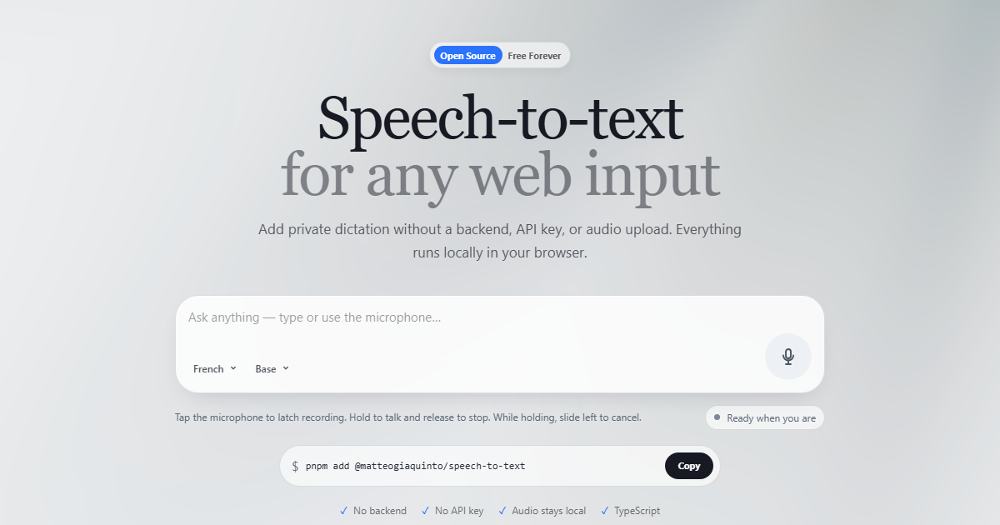

# @matteogiaquinto/speech-to-text

<div align="center">

**Local speech-to-text for web apps.**

Add private, browser-native dictation to any input. No backend, no API key, and no audio upload.

[Live demo](https://matteogiaquinto.github.io/speech-to-text/) · [npm](https://www.npmjs.com/package/@matteogiaquinto/speech-to-text) · [Integration guide](./INTEGRATION.md)

[](https://www.npmjs.com/package/@matteogiaquinto/speech-to-text)
[](https://github.com/matteogiaquinto/speech-to-text/actions/workflows/ci.yml)
[](./LICENSE)


</div>



## Install

```powershell
pnpm add @matteogiaquinto/speech-to-text
```

Use the package manager already used by your project. The package is framework-agnostic and browser-only at runtime.

## Quick start

```ts
import { createSpeechToText } from "@matteogiaquinto/speech-to-text";

const speech = createSpeechToText({
  language: "fr",
  model: "whisper-base",
});

// The model preloads silently after page load by default.
await speech.start();

// The user speaks.
const text = await speech.stop();

console.log(text);
speech.dispose();
```

`language` defaults to `"fr"`; `model` defaults to `"whisper-base"`. `preload` defaults to `"after-load"`; use `"on-demand"` to defer preparation until the first `start()`.

## Features

- Runs Whisper locally in the browser.
- No backend or speech API key.
- Audio stays in the user's browser.
- Uses WebGPU when available, with browser-whisper fallbacks.
- Preloads the selected model after page load and browser idle time by default.
- Reuses downloaded model files through browser origin-private storage.
- Keeps one model cached by default and cleans stale OPFS orphan files.
- French by default, with multilingual Whisper support.
- Multiple Whisper models.
- Framework-agnostic TypeScript API.
- SSR-safe import: browser APIs are only accessed when lifecycle methods run.
- Designed for short commands, form input, and notes.

## Why this package?

[browser-whisper](https://github.com/tanpreetjolly/browser-whisper) already provides the hard inference layer: Whisper models, workers, decoding, WebGPU/WASM execution, and model caching.

This package provides a deliberately smaller application-facing API for product integration:

```text
microphone
   ↓
@matteogiaquinto/speech-to-text
   ↓
browser-whisper
   ↓
Whisper in the browser
   ↓
plain text
```

The goal is not to reimplement Whisper. The goal is to make adding local dictation to real web products predictable and repeatable.

## Models

The wrapper accepts the models supported by the installed `browser-whisper` version.

Common choices:

| Model                    | Relative speed | Relative accuracy | Good fit                                    |
| ------------------------ | -------------- | ----------------- | ------------------------------------------- |
| `whisper-tiny`           | Fastest        | Lower             | Very lightweight dictation                  |
| `whisper-base`           | Fast           | Good              | Default / balanced                          |
| `whisper-small`          | Slower         | Better            | Higher-quality short dictation              |
| `whisper-large-v3-turbo` | Heavier        | Higher            | Powerful devices where quality matters more |

Example:

```ts
const speech = createSpeechToText({
  language: "fr",
  model: "whisper-small",
});
```

A single `SpeechToText` instance uses one model. Create a new instance when you intentionally change models.

## Product integration

For CRM, forms, admin panels, and other applications, follow [INTEGRATION.md](./INTEGRATION.md).

The standard integration uses a compact microphone that morphs into a left-expanding recording capsule with elapsed time, waveform feedback, and a stop mark. AI-style prompts use an auto-growing composer with the voice control in the bottom toolbar; ordinary inputs keep it at the far right. See [`docs/VOICE-UI.md`](./docs/VOICE-UI.md) for the canonical interaction contract.

Coding agents working from this repository should also follow [AGENTS.md](./AGENTS.md).

## Lifecycle

- By default, model preparation is scheduled after the page has loaded and the browser becomes idle.
- `prepare()` is idempotent and single-flight; explicit calls can still force readiness at any time.
- `start()` ensures the model is prepared, then requests microphone access and begins recording.
- `isPrepared()` reports whether the model is initialized in the current runtime.
- `stop()` stops the microphone, transcribes locally, and returns plain text.
- `dispose()` cancels scheduled/in-flight preparation, stops tracks, cancels transcription, and releases runtime resources.

Use `preload: "on-demand"` when a host application does not want background preparation after page load. `start()` rejects while already recording. `stop()` rejects when no recording is active.

Errors are exposed as `SpeechToTextError`, `MicrophoneError`, or `TranscriptionError`, with the underlying error available as `cause`.

## Model cache

Model files are stored by `browser-whisper` in browser origin-private storage.

The useful mental model is:

```text
browser profile + site origin = model cache
```

Later visits to the same origin normally reuse the stored model instead of downloading it again. Reopening the browser does not normally create another copy.

The wrapper defaults to `cachePolicy: "single-model"`: after the selected model is ready, cached files for other browser-whisper models are removed and stale unreferenced OPFS files older than 24 hours are cleaned. Sites that intentionally need several cached models can use `cachePolicy: "keep-all"`.

A different domain/subdomain, browser, browser profile, private session, cleared site data, or different computer can require another download. Calling `dispose()` releases runtime resources but does not clear the selected downloaded model.

The default `whisper-base` model is substantial (approximately 136 MB), so the first preparation can take noticeably longer than later uses.

## Browser requirements and privacy

Production microphone capture requires a secure browser context (normally HTTPS; localhost is acceptable for local development).

The package inherits browser-whisper's WebGPU, WebCodecs, and WASM constraints. Threaded WASM can require cross-origin isolation headers:

```text
Cross-Origin-Embedder-Policy: require-corp
Cross-Origin-Opener-Policy: same-origin
```

Do not add those headers blindly to an existing product; they can affect third-party resources. Verify the complete application when enabling cross-origin isolation.

Model files are fetched during preparation when not already cached (background after page load by default), but recorded audio and transcription stay in the browser. Review browser-whisper's own hosting and model-download behavior before making production privacy guarantees.

## Live demo

The demo source lives in [`examples/browser`](./examples/browser).

Run it locally:

```powershell
pnpm install
pnpm example:dev
```

Then open the URL printed by Vite. The public demo is designed around the same integration pattern used in products: one input, one microphone button, local model preparation, recording, and transcription.

## Composition with text-to-data

This package has no dependency on `@matteogiaquinto/text-to-data`. Compose them at the application boundary:

```ts
const text = await speech.stop();
// Then pass text to @matteogiaquinto/text-to-data.
```

## Development

Requires Node.js 22+ and pnpm.

```powershell
pnpm install
pnpm typecheck
pnpm lint
pnpm test
pnpm build
pnpm example:build
```

CI runs these checks on pushes and pull requests.

## License

[MIT](./LICENSE). `browser-whisper` is also MIT-licensed and is consumed as a normal dependency; no upstream inference source is copied into this package.

## Cancellation

`await speech.cancel()` stops microphone capture, discards chunks, and retains the prepared model. An interrupted `stop()` resolves to an empty string; no transcript is delivered. Cancellation during transcription requests stream cancellation and suppresses even late results. Repeated cancellation is safe, and a recording can start again after cancellation. Cancellation during pending preparation or microphone permission invalidates that start; preparation is retained and any late microphone tracks are released. Wait for that pending `start()` to settle before starting again (browser permission dialogs cannot be programmatically dismissed). `dispose()` remains permanent teardown and makes the instance unusable.
